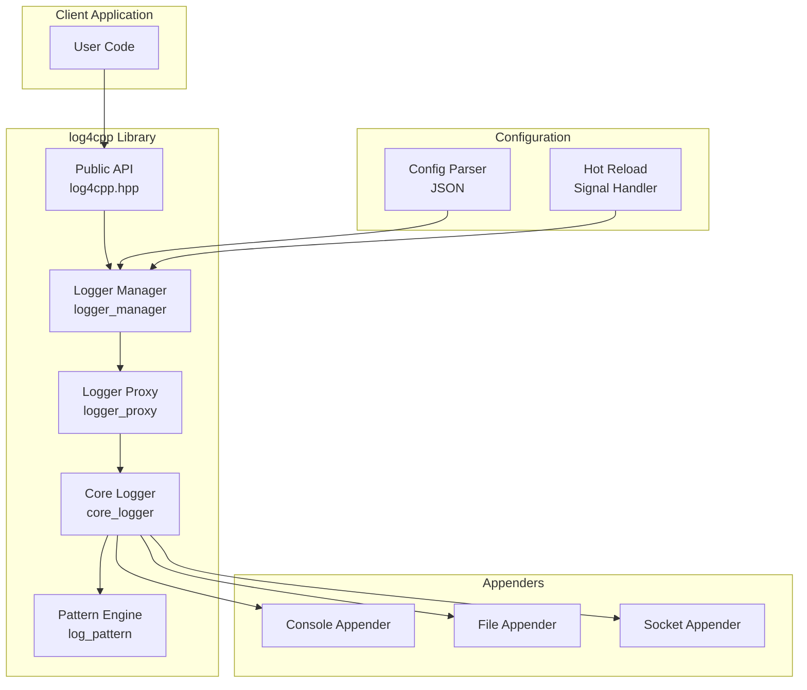
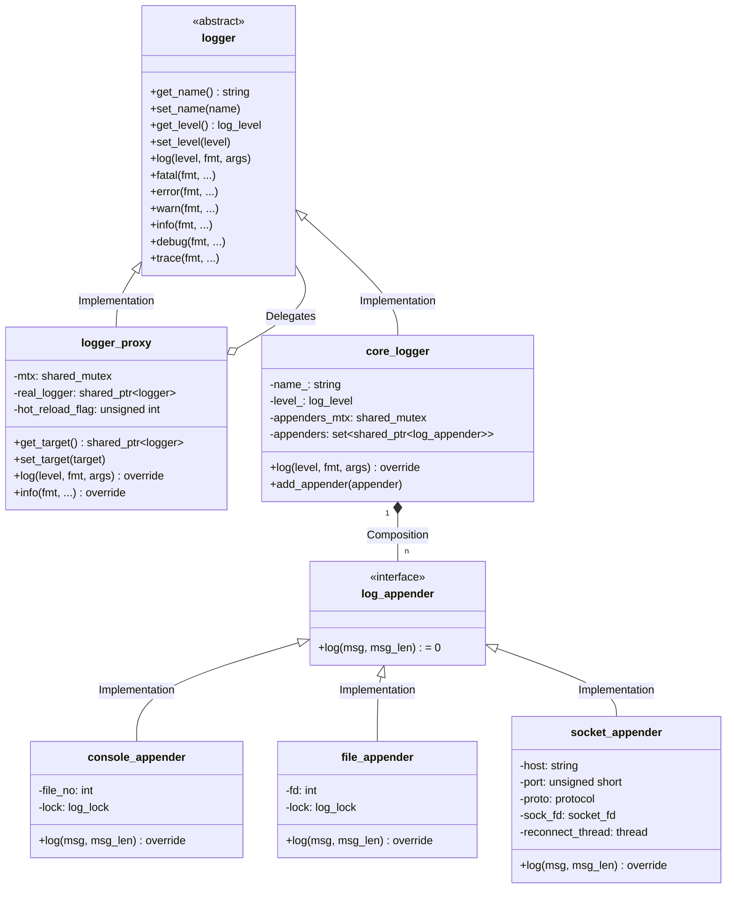
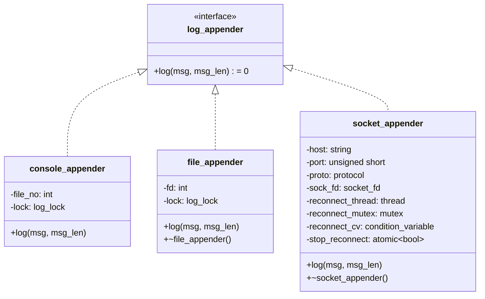
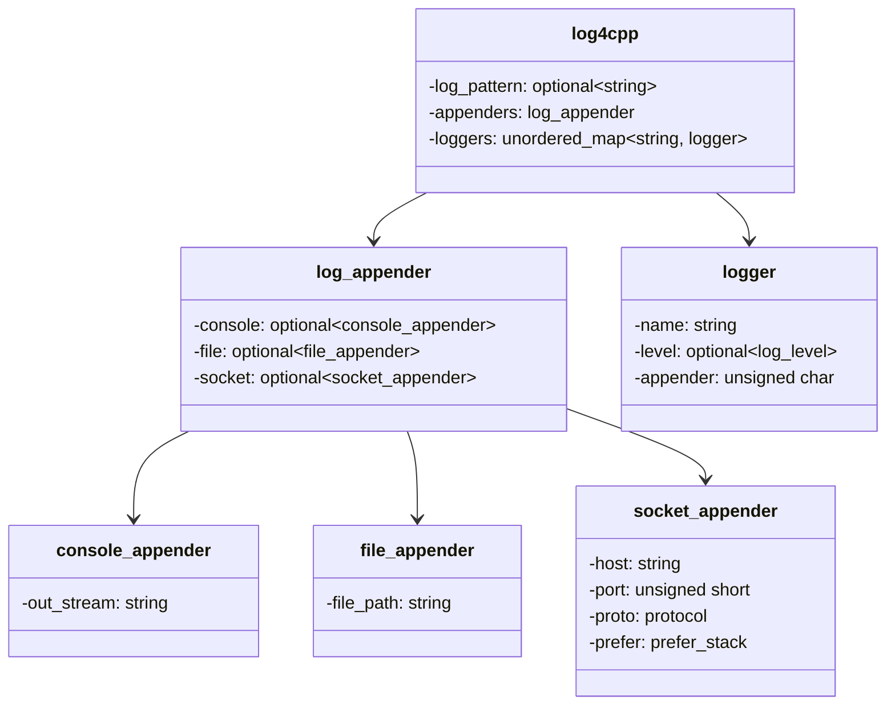
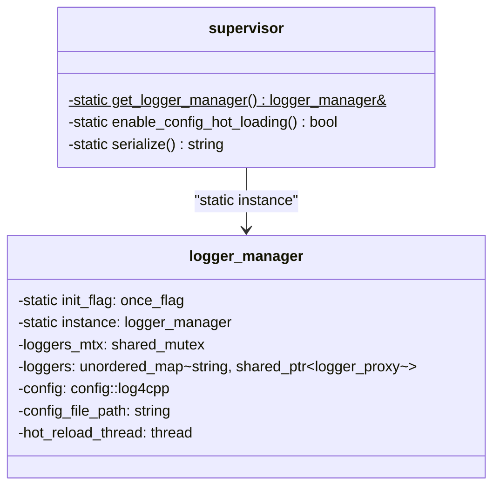
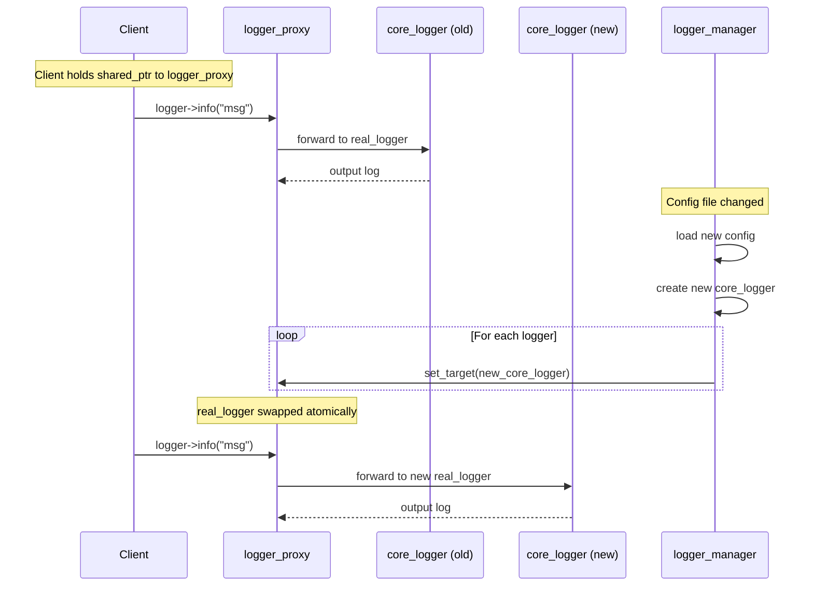
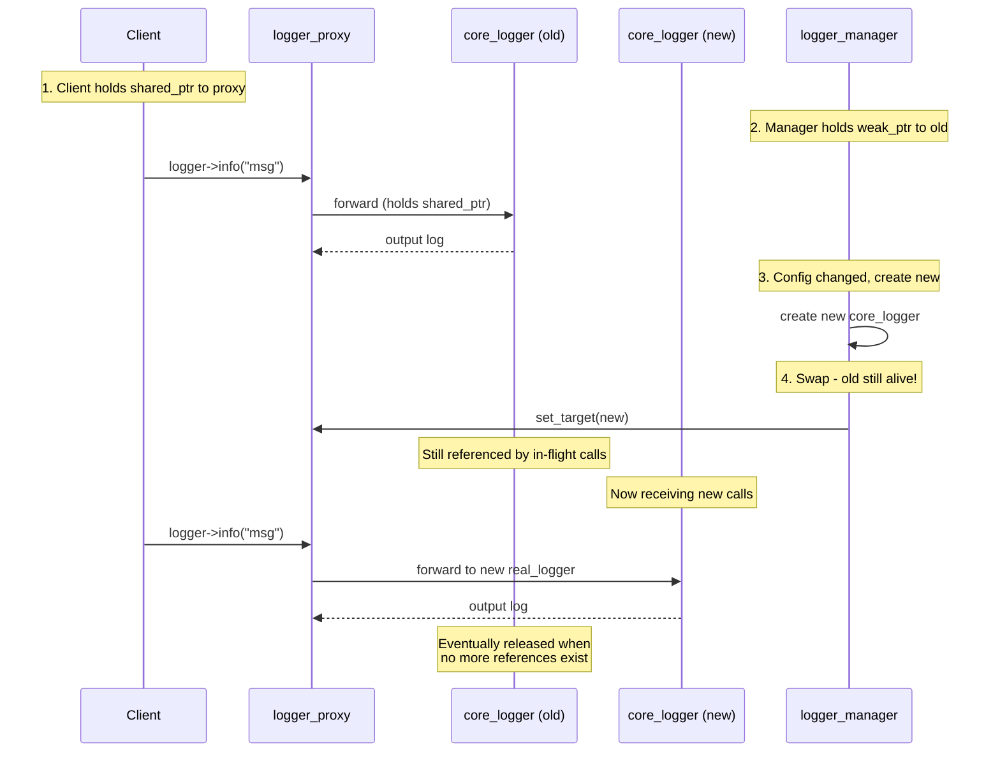
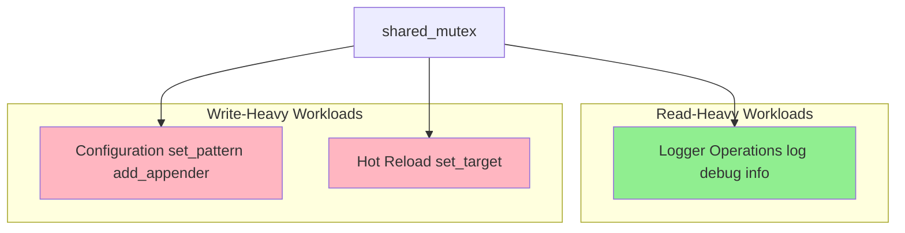
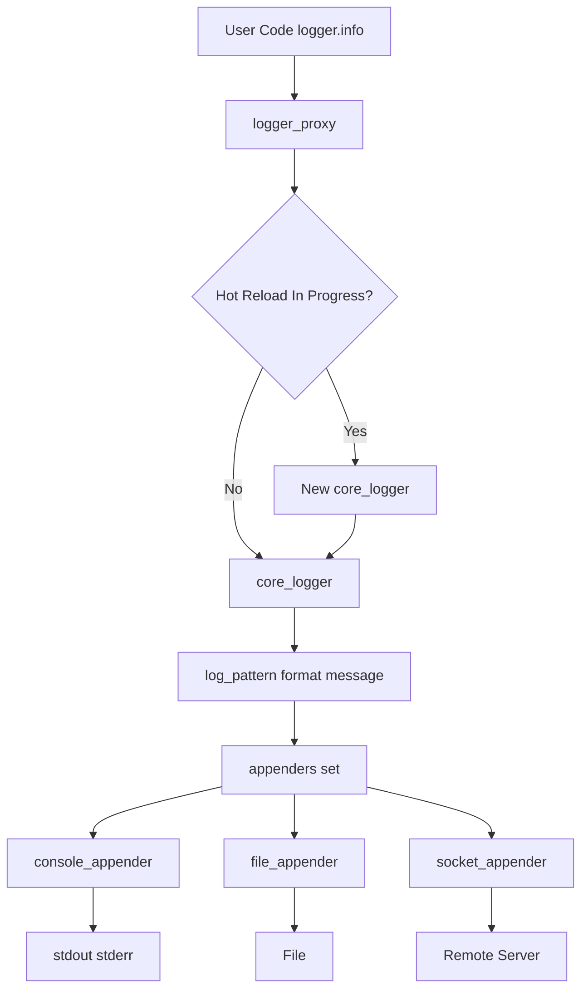
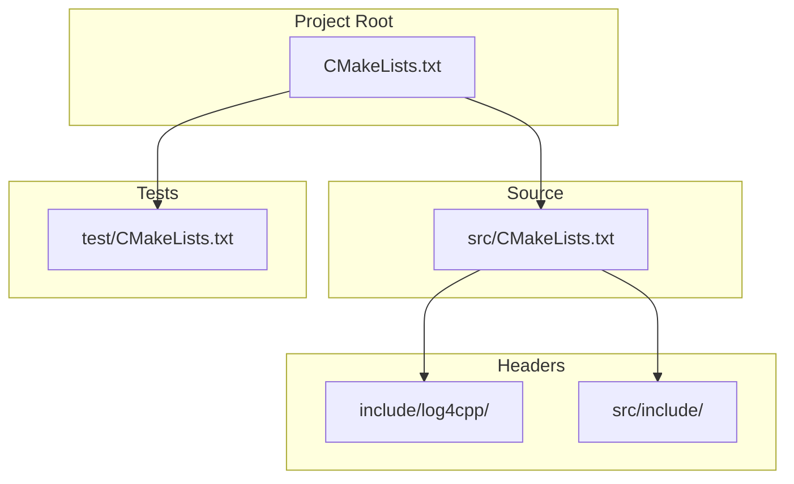

# log4cpp Design Document

## 1. Overview

**log4cpp** is a C++ logging library inspired by Apache log4j. It provides a flexible, thread-safe logging framework with JSON-based configuration, multiple output appenders, and hot configuration reload capability.

### 1.1. Key Features

- JSON-based configuration (no code modification required)
- Multiple appender types: Console, File, Socket (TCP/UDP)
- Singleton pattern for global access
- Thread-safe implementation
- Hot configuration reload without process restart (Linux only)
- Pattern-based log formatting

---

## 2. Architecture

### 2.1. System Architecture Diagram



### 2.2. Component Overview

| Component | Responsibility |
|-----------|----------------|
| `logger_manager` | Singleton managing all loggers, configuration loading |
| `logger_proxy` | Proxy pattern for hot-reload support |
| `core_logger` | Core logging implementation |
| `log_pattern` | Format log messages with patterns |
| `console_appender` | Output to stdout/stderr |
| `file_appender` | Output to file |
| `socket_appender` | Output to remote log server |

---

## 3. Class Design

### 3.1. Class Diagram



### 3.2. Core Classes

#### 3.2.1. Logger Interface (`logger`)

```cpp
// filepath: include/log4cpp/log4cpp.hpp
class logger {
public:
    virtual ~logger() = default;

    virtual std::string get_name() const = 0;
    virtual void set_name(const std::string &name) = 0;

    virtual log_level get_level() const = 0;
    virtual void set_level(log_level level) = 0;

    virtual void log(log_level _level, const char *fmt, va_list args) = 0;

    // Convenience methods
    virtual void fatal(const char *fmt, ...) const = 0;
    virtual void error(const char *fmt, ...) const = 0;
    virtual void warn(const char *fmt, ...) const = 0;
    virtual void info(const char *fmt, ...) const = 0;
    virtual void debug(const char *fmt, ...) const = 0;
    virtual void trace(const char *fmt, ...) const = 0;
};
```

#### 3.2.2. Logger Proxy (`logger_proxy`)

The `logger_proxy` implements the **Proxy Design Pattern** to support hot configuration reload:

```cpp
// filepath: include/log4cpp/logger.hpp
class logger_proxy : public logger {
private:
    mutable std::shared_mutex mtx;
    std::shared_ptr<logger> real_logger;
    unsigned int hot_reload_flag{0};

public:
    explicit logger_proxy(std::shared_ptr<logger> target_logger);

    std::shared_ptr<logger> get_target();
    void set_target(std::shared_ptr<logger> target);  // Atomic swap
};
```

#### 3.2.3. Core Logger (`core_logger`)

```cpp
// filepath: src/include/logger/core_logger.hpp
class core_logger : public logger {
private:
    std::string name_;
    log_level level_;
    mutable std::shared_mutex appenders_mtx;
    std::set<std::shared_ptr<appender::log_appender>> appenders;

public:
    void add_appender(const std::shared_ptr<appender::log_appender> &appender);
    void log(log_level _level, const char *fmt, va_list args) const override;
};
```

---

## 4. Appender Design

### 4.1. Appender Class Diagram



### 4.2. Appender Details

#### 4.2.1. Console Appender

Outputs log messages to stdout or stderr:

```cpp
// filepath: src/include/appender/console_appender.hpp
class console_appender : public log_appender {
private:
    int file_no = -1;
    common::log_lock lock;

public:
    explicit console_appender(const config::console_appender &cfg);
    void log(const char *msg, size_t msg_len) override;
};
```

#### 4.2.2. File Appender

Writes log messages to a specified file:

```cpp
// filepath: src/include/appender/file_appender.hpp
class file_appender : public log_appender {
private:
    int fd{-1};
    common::log_lock lock;

public:
    explicit file_appender(const config::file_appender &cfg);
    void log(const char *msg, size_t msg_len) override;
    ~file_appender() override;
};
```

#### 4.2.3. Socket Appender

Sends log messages to a remote log server via TCP or UDP:

```cpp
// filepath: src/include/appender/socket_appender.hpp
class socket_appender : public log_appender {
private:
    std::string host;
    unsigned short port{0};
    config::socket_appender::protocol proto;
    common::prefer_stack ip_stack;

    std::shared_mutex connection_rw_lock;
    common::socket_fd sock_fd;
    connection_fsm_state connection_state;

    std::mutex reconnect_mutex;
    std::condition_variable reconnect_cv;
    std::atomic<bool> stop_reconnect{false};
    std::thread reconnect_thread;

    // Exponential backoff: 1s to 24h
    static constexpr auto RECONNECT_INITIAL_DELAY = 1s;
    static constexpr auto RECONNECT_MAX_DELAY = 24h;
};
```

---

## 5. Configuration System

### 5.1. Configuration Class Diagram



### 5.2. Configuration JSON Schema

```json
{
  "log-pattern": "${yyyy}-${MM}-${dd} ${HH}:${mm}:${ss} [${8TN}] [${L}] -- ${msg}",
  "appenders": {
    "console": {
      "out_stream": "stdout"
    },
    "file": {
      "file_path": "/var/log/myapp.log"
    },
    "socket": {
      "host": "log-server.example.com",
      "port": 9999,
      "proto": "TCP",
      "prefer": "IPV4"
    }
  },
  "loggers": [
    {
      "name": "root",
      "level": "INFO",
      "appender": 7
    },
    {
      "name": "myapp",
      "level": "DEBUG",
      "appender": 3
    }
  ]
}
```

### 5.3. Appender Flag Mapping

| Flag | Binary | Appenders |
|------|--------|-----------|
| 1    | 0b001  | Console   |
| 2    | 0b010  | File      |
| 3    | 0b011  | Console + File |
| 4    | 0b100  | Socket    |
| 5    | 0b101  | Console + Socket |
| 6    | 0b110  | File + Socket |
| 7    | 0b111  | Console + File + Socket |

---

## 6. Pattern Engine

### 6.1. Pattern Format

The `log_pattern` class formats log messages using placeholders:

```cpp
// filepath: src/include/pattern/log_pattern.hpp
class log_pattern {
private:
    static std::string _pattern;

public:
    static void set_pattern(const std::string &pattern);
    static size_t format(char *buf, size_t buf_len, const char *name,
                        log_level level, const char *fmt, ...);
};
```

### 6.2. Supported Placeholders

| Token | Description | Example |
|-------|-------------|---------|
| `${yyyy}` | 4-digit year | 2026 |
| `${MM}` | 2-digit month | 04 |
| `${dd}` | 2-digit day | 24 |
| `${HH}` | 2-digit hour (24h) | 14 |
| `${mm}` | 2-digit minute | 30 |
| `${ss}` | 2-digit second | 45 |
| `${8TN}` | Thread name (padded to 8) | main    |
| `${L}` | Log level | INFO |
| `${msg}` | User message | Operation completed |

---

## 7. Logger Manager

### 7.1. Singleton Pattern



### 7.2. Key Responsibilities

1. **Singleton Management**: Ensure only one instance exists via `std::once_flag`
2. **Logger Creation**: Create and manage loggers by name via `get_logger()`
3. **Configuration Loading**: Parse JSON configuration files via `load_config()`
4. **Hot Reload**: Run event loop thread to receive SIGHUP signals (Linux)
5. **Appender Management**: Create and manage console, file, socket appenders
6. **Logger Lifecycle**: Use custom `logger_deleter` to auto-release loggers on destruction

---

## 8. Hot Configuration Reload

### 8.1. Key Mechanism: Proxy Pattern

The core of hot configuration reload is the **Proxy Design Pattern**. Clients hold a `shared_ptr<logger_proxy>` which forwards all logging calls to an internal `real_logger` pointer. When configuration changes:



### 8.2. Hot Reload Process

1. **Client holds proxy**: Users get `shared_ptr<logger_proxy>` which never changes
2. **Signal received**: SIGHUP triggers `notify_config_hot_reload()`
3. **Create new loggers**: Manager creates new `core_logger` instances from updated config
4. **Atomic swap**: `logger_proxy::set_target()` replaces `real_logger` pointer
5. **Transparent to client**: No code changes needed, proxy forwards to new implementation

### 8.3. Object Lifetime Safety

The key challenge: **how to ensure in-use objects don't become invalid during reload?**



**Lifetime management strategy:**

- **Client → Proxy**: Client holds `shared_ptr<logger_proxy>` (never changes)
- **Proxy → Real Logger**: Proxy holds `shared_ptr<logger>` to `core_logger`
- **Manager → Loggers**: Manager holds `weak_ptr<logger_proxy>` to track loggers
- **Old logger kept alive**: Old `core_logger` remains valid until all in-flight calls complete

```cpp
// When swapping, old logger is NOT deleted immediately
// It remains alive because proxy still holds shared_ptr to it
void logger_proxy::set_target(std::shared_ptr<logger> target) {
    std::unique_lock lock(mtx_);
    // Old real_logger automatically kept alive by the shared_ptr
    // Only released when no more callers hold reference to proxy
    real_logger = target;
}
```

**Why this works:**
- `shared_ptr` reference counting keeps old object alive
- Old logger is released only when **all** proxies have been updated
- In-flight logging calls complete with old configuration
- New logging calls use new configuration

```cpp
// Hot reload atomic swap
void logger_proxy::set_target(std::shared_ptr<logger> target) {
    std::unique_lock lock(mtx_);
    real_logger = target;  // Atomic at shared_ptr level
}
```

### 8.4. Implementation Details

- **Signal Handler**: Register SIGHUP handler via `supervisor::enable_config_hot_loading()`
- **Event Loop**: Background thread using `eventfd` to receive reload signals
- **Thread Safety**: `std::shared_mutex` protects the `real_logger` pointer
  - Logging operations use shared lock (multiple readers)
  - `set_target()` uses unique lock (single writer)

---

## 9. Thread Safety

### 9.1. Synchronization Strategy



### 9.2. Locking Strategy

| Component | Lock Type | Purpose |
|-----------|-----------|---------|
| `logger_proxy::mtx` | `shared_mutex` | Protect `real_logger` pointer |
| `core_logger::appenders_mtx` | `shared_mutex` | Protect appender set |
| `socket_appender::connection_rw_lock` | `shared_mutex` | Protect socket connection |
| `console_appender::lock` | `log_lock` | Platform-specific file locking |
| `file_appender::lock` | `log_lock` | Platform-specific file locking |

---

## 10. Data Flow

### 10.1. Logging Data Flow



---

## 11. Build System

### 11.1. CMake Structure



### 11.2. Dependencies

- **Required**: CMake 3.11+, C++17 compiler
- **External**: nlohmann-json >= 3.0
- **Platform**: Linux (hot reload), Windows/macOS (basic)

---

## 12. Usage Example

### 12.1. Basic Usage

```cpp
#include <log4cpp/log4cpp.hpp>

int main() {
    // Load configuration
    log4cpp::supervisor::get_logger_manager().load_config("./log4cpp.json");

    // Get logger
    auto logger = log4cpp::supervisor::get_logger_manager().get_logger("myapp");

    // Log messages
    logger->info("Application started");
    logger->debug("Processing request: %s", request_id);
    logger->error("Failed to connect to database");

    return 0;
}
```

### 12.2. Class Usage

```cpp
class MyClass {
private:
    std::shared_ptr<log4cpp::logger> logger_;

public:
    MyClass() {
        logger_ = log4cpp::supervisor::get_logger_manager().get_logger("MyClass");
    }

    void process() {
        logger_->info("Processing in MyClass");
    }
};
```

---

## 13. Extension Points

### 13.1. Adding Custom Appenders

```cpp
class my_appender : public log4cpp::appender::log_appender {
public:
    explicit my_appender(const config::my_appender &cfg) : config_(cfg) {}

    void log(const char *msg, size_t msg_len) override {
        // Custom implementation
    }

private:
    config::my_appender config_;
};
```

### 13.2. Custom Pattern Tokens

Extend `log_pattern` class to support additional tokens:

```cpp
namespace log4cpp::pattern {
    // Add new token handling in format_with_pattern()
}
```
